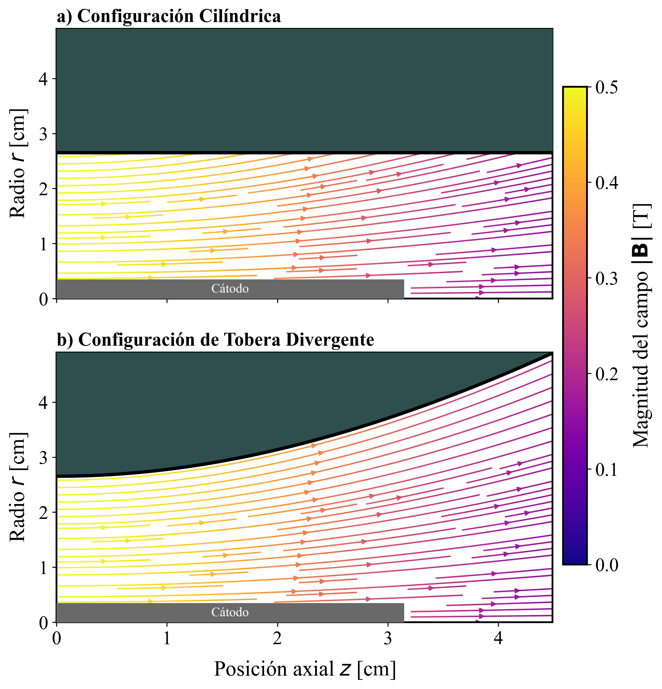
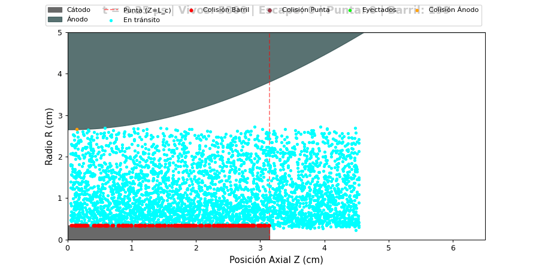

# Predicción de erosión catódica en propulsores AF-MPD

**Modelo cinético, cierre termoiónico y evaluación de blindaje magnético HTS**

Ignacio Díaz · Gonzalo Avaria — Departamento de Física, Universidad Técnica Federico Santa María

---

La vida útil de los propulsores magnetoplasmadinámicos de campo aplicado (AF-MPD) está
severamente limitada por la erosión de sus electrodos. Este trabajo desarrolla una cadena de
modelos para predecirla en un propulsor de **10 kW** operando a **222 A**, y evalúa el blindaje
magnético mediante bobinas superconductoras de alta temperatura crítica (HTS).

📄 **[Informe completo](./informe/informe-2026.pdf)** · 19 páginas

---

## La cadena de modelos

| Etapa | Qué resuelve |
|---|---|
| **1. Geometría** | Dimensiona los electrodos con una función objetivo fenomenológica sujeta a restricciones físicas de densidad de corriente y esbeltez estructural |
| **2. Modelo cinético** | Integra las trayectorias de iones Ar⁺ como partículas de prueba con el algoritmo de Boris, en campos **evaluados analíticamente en la posición de cada ion** |
| **3. Blindaje HTS** | Barre la intensidad del campo de tobera y evalúa una topología de *cusp* magnético |
| **4. Cierre termoiónico** | La carga térmica obtenida alimenta un solver de conducción que cierra el balance energético de la superficie mediante la ley de Richardson-Dushman |

El modelo cinético **no es un esquema PIC, MHD ni híbrido**: no resuelve campos
autoconsistentes, no deposita carga sobre una malla y no incluye colisiones. Es un trazado
lagrangiano de iones en campos dados, lo que elimina por completo el error de discretización
espacial.



---

## Resultados principales

Todos los valores se reportan como media ± desviación estándar sobre semillas
estadísticamente independientes.

### El bombardeo iónico no erosiona mecánicamente

| Magnitud | Valor |
|---|---|
| Iones que impactan el barril del cátodo | 16.4 ± 0.5 % |
| Energía de impacto media | 7.56 ± 0.13 eV |
| Umbral de pulverización Ar → W | ~30 eV |

La energía de impacto queda **muy por debajo del umbral** en todo el rango de temperatura
electrónica medido experimentalmente. La erosión en régimen estacionario resulta, por tanto,
de naturaleza **térmica y no mecánica**.



### El blindaje HTS funciona, pero el *cusp* no

| Configuración | Carga térmica sobre el cátodo | Escape |
|---|---|---|
| Base (0.5 T, bobina de cobre) | referencia | 81.8 % |
| **HTS uniforme (5 T)** | **−68 ± 3 %** | **91.4 %** |
| Cusp (0.5 + 1 T) | contraproducente | 24.4 % |

El refuerzo uniforme confina el flujo iónico a las líneas de campo y reconfigura el potencial
de vaina. La topología de *cusp*, en cambio, **desmagnetiza a los iones** y empeora el
resultado: es un caso donde la intuición de «desviar» las partículas falla.

### El hallazgo de diseño: manda la función de trabajo, no el punto de fusión

Cerrar el balance energético de la superficie con la condición de emisión termoiónica fija la
temperatura a la que cada emisor sostiene la corriente del arco:

| Emisor | Función de trabajo | Temperatura de operación | Vida útil por evaporación |
|---|---|---|---|
| Tungsteno puro | 4.55 eV | **3623 K** — apenas 72 K bajo su fusión | del orden de **horas** |
| Tungsteno toriado | 2.63 eV | 2706 K | ~9 **años** |

El criterio habitual de elegir el material refractario con mayor punto de fusión resulta
insuficiente: la restricción vinculante es la **función de trabajo**. Un cátodo de tungsteno
puro tendría que operar rozando su temperatura de fusión para sostener la descarga.

---

## Estructura del repositorio

```
informe/
  informe-2026.pdf              versión actual (19 pp)
  preliminar-fis205.pdf         versión preliminar (14 pp)
notebooks/
  modelo-actual.ipynb           el modelo vigente, ordenado y documentado
  completo-sin-limpiar.ipynb    archivo completo de trabajo, con el material exploratorio
  preliminar-fis205.ipynb       estado correspondiente al informe preliminar
multimedia/                     animaciones y figuras generadas
preliminar-cpp/                 módulo C++ de la etapa descartada
```

### Los tres cuadernos

- **`modelo-actual.ipynb`** es el que hay que leer. Contiene las 22 secciones del modelo
  vigente, con las salidas y figuras conservadas tal como se generaron. Pesa 1 MB y se abre
  directamente en GitHub.
- **`completo-sin-limpiar.ipynb`** conserva además las dos etapas preliminares del integrador y
  todo el material exploratorio. Pesa 19 MB, por lo que GitHub no lo muestra en el navegador;
  hay que descargarlo.
- **`preliminar-fis205.ipynb`** es el estado del trabajo en la versión preliminar.

---

## Sobre la etapa preliminar en C++

Las primeras versiones del integrador resolvían sobre **malla discretizada**, con campos
efectivos impuestos por regiones, apoyadas en un módulo C++ enlazado a Python mediante
pybind11. Ambas fueron **descartadas** en favor del modelo de campos analíticos.

El motivo no fue de rendimiento sino de formulación: evaluar los campos analíticamente en la
posición de cada ion elimina el error de discretización espacial, y el avance temporal se
vectoriza con NumPy sobre el arreglo completo de partículas. Una corrida de 4000 iones a lo
largo de 3×10⁵ pasos temporales se completa en decenas de segundos en un computador de
escritorio, lo que es precisamente lo que habilita el valor del estudio: no una corrida
aislada, sino decenas de ellas con repeticiones sobre semillas independientes y barridos
sistemáticos de parámetros.

El código de esa etapa se conserva en [`preliminar-cpp/`](./preliminar-cpp) por transparencia
metodológica.

---

## Ejecución

```bash
pip install -r requirements.txt
```

```bash
jupyter notebook notebooks/modelo-actual.ipynb
```

El cuaderno no depende de archivos externos ni del módulo C++: genera sus propios datos. Las
celdas de barrido con estadística sobre semillas son las más lentas, del orden de minutos.

---

## Trabajo futuro

- **Solver magnetohidrodinámico** acoplado a los modelos de superficie, con validación en dos
  etapas: la física *self-field* contra la base de datos de desempeño de referencia, y la
  configuración de campo aplicado contra los propulsores superconductores recientes.
- **Función de mérito para el material emisor.** El cierre termoiónico identifica el conjunto
  de propiedades que gobierna la vida útil del cátodo —función de trabajo, presión de vapor,
  conductividad térmica y emisividad— y la jerarquía entre ellas. Eso define una función de
  mérito explícita que habilita explorar sistemáticamente el espacio de materiales, aleaciones
  y compuestos emisores mediante aprendizaje automático.

---

## Contacto

Ignacio Díaz — [idiazi@usm.cl](mailto:idiazi@usm.cl)
